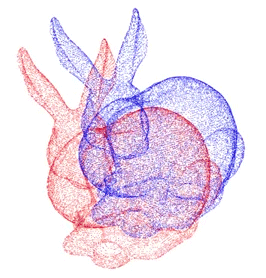
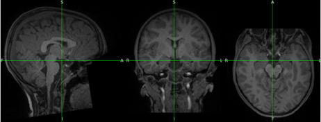
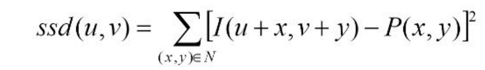
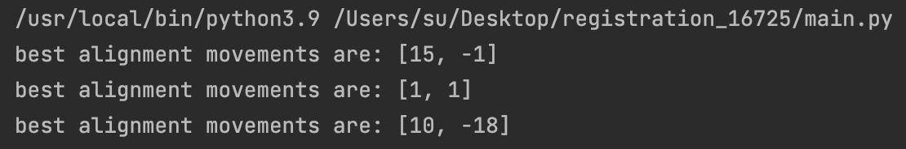
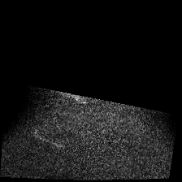
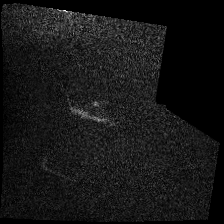

# 16725 - Biomedical Image Analysis - Final Project

## 2D Automated Registration on MRI Sequences
###Background
This repo contains the implementation for an automated registration on 2D MRI sequences.

<div align="center">
    
</div>
<p align="center">
    The above is an example registration. [1]
</p>

Capturing an MRI sequence can take anywhere on the order of minutes to hours. Because MRIs can take so long to acquire,
the subject inside the machine might unintentionally shift around and cause misalignment to occur. Registering a subject's
MRI scans can help improve the image's alignment, and therefore, clarity.

For this project, I:
- Use SimpleITK's inbuilt Sobel filter in order to crop out the less relevant black pixels in the NIFTI.
- Use L2 norm/sum of squared differences (SSD) in order to align the different brain MRI slices with each other.

### Setup
This codebase was run on a Mac M1 chip, using SimpleITK v2.1.1.1 and Numpy-1.22.3. Pip3 was used to install these two packages.
Conda was used to create a separate environment for this project. The below commands were run in order to set up the new environment:
```bash
conda create --n 725-final-prj
conda activate 725-final-prj
```

To generate a set of registered images, run the following command:
```bash
python main.py
```

In order to generate a GIF using the set of aligned images, run the following command:
```bash
python convertToGif.py
```
Note that for convertToGif, certain argparse commands may need to be changed depending on where you chose to put your directory.

#### Main file
This python file opens the NIFTI file applies the Sobel filter, and saves each slice of the MRI as a separate image in order
for alignment of all the images against each other. Mergesort is employed to more quickly align all these images against each
other. SITK is used to unpack the files and apply the Sobel edge detection filter here.

#### Convert To GIF file
Given a directory with MRI images, this file generates a GIF.

#### Alignment file
Given two images to align with respect to each other, this python file will use the L2 norm algorithm to find the optimal
alignment and return the best possible alignment as well as the lowest sum of squared differences found within a certain 
pre-specified window.

### Dataset 

OpenNeuro was used in order to source the MRI data used in this project. The Reading-related functional activity in children 
with isolated spelling deficits and dyslexia [dataset](https://openneuro.org/datasets/ds003126/versions/1.2.0) was used. 
For a proof of concept, the T1-weighted anatomy NIFTI from sub-047EPKL011005 was analyzed for this project.

<div align="center">
    
</div>
<p align="center">
    sub-047EPKL011005's T1-weighted NIFTI.
</p>

### L2 Norm / Sum of Squared Differences Algorithm
There are multiple algorithms that can be used to align images. One such algorithm that can be used in order to find the 
best alignment between two images is L2 norm. The L2 norm algorithm involves the squared difference between pixel i,j in 
image 1 and pixel i,j in image 2 to be calculated. All of these differences between each pixel pair are accumulated to generate 
the sum of squared difference for **one** possible image alignment combination. That is, to say, there are i*j different alignment 
combinations between the two images. The best alignment combination between these two images will be the **smallest** sum of
squared differences that was calculated.

<div align="center">
    
</div>
<p align="center">
    L2 Norm algorithm. [2]
</p>
 
However, there is still one more problem–this algorithm will take *O(ij)* to run, which is way too long. One solution to this 
issue is to only run L2 norm over a smaller pixel window in the two images. This does not cut into the visual product of the 
algorithm in any human noticeable way, and shortens the time needed greatly. For this project, I used a window size of 35x35 pixels.

## Results
The following are the results generated by my registration and GIF code.

### Sobel Filter

<div align="center">
    
</div>
<p align="center">
    GIF of the Sobel filtered NIFTI without alignment.
</p>

### Alignment

<div align="center">
    
</div>
<p align="center">
    GIF of the original NIFTI without alignment.
</p>

<div align="center">
    
</div>
<p align="center">
    GIF of the registered NIFTI.
</p>

My L2 norm alignment algorithm was able to make some better alignment recommendations, although it is hard to tell by just
looking at the outputted GIFs. As it is somewhat hard to tell the differences between these two GIFs by human eye, I also 
have included parts of my registration run's printouts. These printouts can be seen under assets/alignmentPrintout.txt.

<div align="center">
    
</div>
<p align="center">
    This screenshot is an example of the best alignment recommendations for the first few frames of the MRI.
</p>

Based on the printouts, this L2 Norm registration algorithm was more effective at "registering" the first and last few frames
of the MRI. This makes sense as those frames are the most ambiguous of the bunch and are oftentimes very misaligned. However,
there were still small adjustments of a few pixels each made between most frames in the middle of the MRI. This makes sense
as there are no huge alignment differences between neighboring brain slices on this subject.

<div align="center">
    
</div>
<div align="center">
    
</div>
<p align="center">
    The images shown here are the second and third frames of this subject's MRI sequence, respectively. As you can see, there
    is a noticeable lack of alignment between the two.
</p>

## Conclusion and Future Steps
My alignment algorithm was not able to show the most clear results because the brain MRI for the dyslexic child was already
properly aligned to begin with. I was unable to find a more misaligned MRI dataset when searching for data to use for this 
project to demonstrate its full ability for registration. In order to test this logic better going forward, I would ideally
be able to capture a T1 scan of a subject's "expected" anatomy (aka while the subject is lying still in the machine), and 
take another T1 scan of the same subject where I instructed them to move once every few seconds.

## References
1. https://medium.com/pymedix/a-brief-history-of-medical-image-registration-part-2-aecd188855fc
2. https://learning-image-synthesis.github.io/sp22/static_files/lectures/lecture4.pdf
